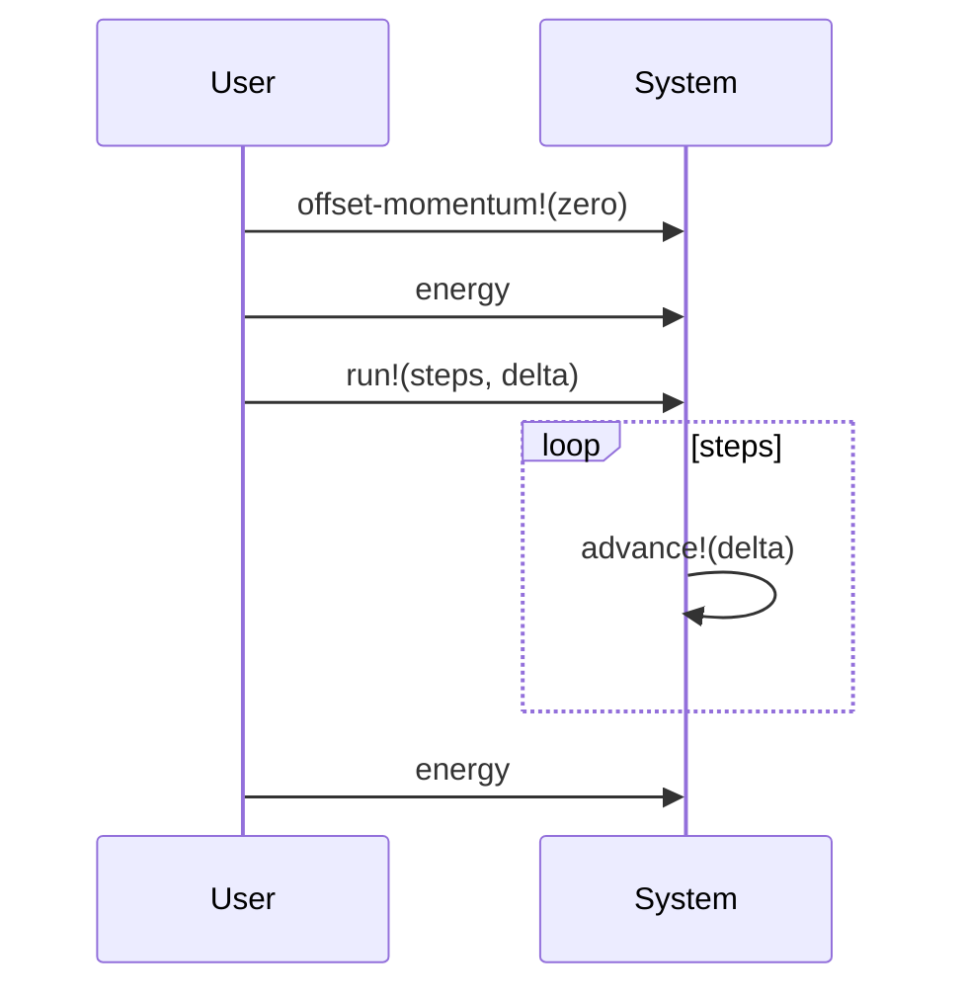

# dylan-nbody
N body problem written in Open dylan

This code is a test vehicle for my vector library
[v3d](http://github.com/fraya/v3d) and is **NOT performance driven**.

For a competitive example see
[shootout/n-body.dylan](https://github.com/dylan-lang/shootout/blob/master/n-body.dylan).

## Usage

Clone the repository:

    git clone http://github.com/fraya/dylan-nbody

Enter in the directory created and update dependencies:

    dylan update

Compile the program:

    dylan build dylan-nbody-app

Execute the program in directory `../_build/bin`, passing the
number of steps to simulate, for instance `500000`:

    dylan-nbody-app --steps 500000

The output is:

    -0.1690752d0
    -0.1690966d0

# Sequence diagram

The following sequence diagram shows the execution of the main
program.

